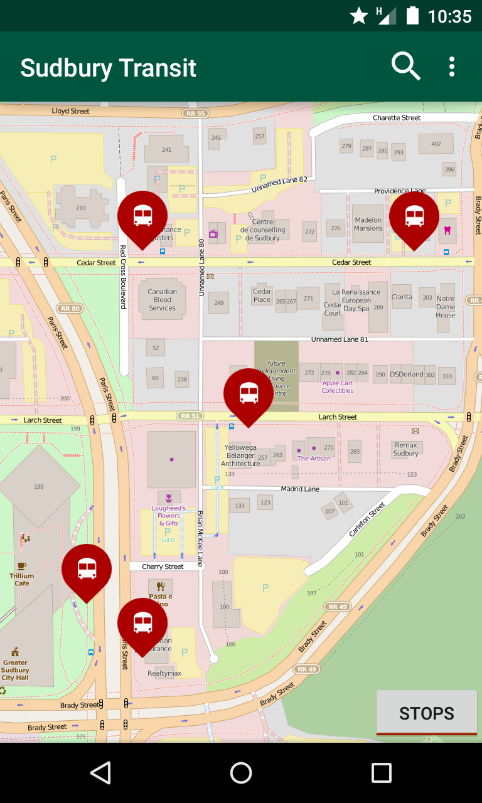
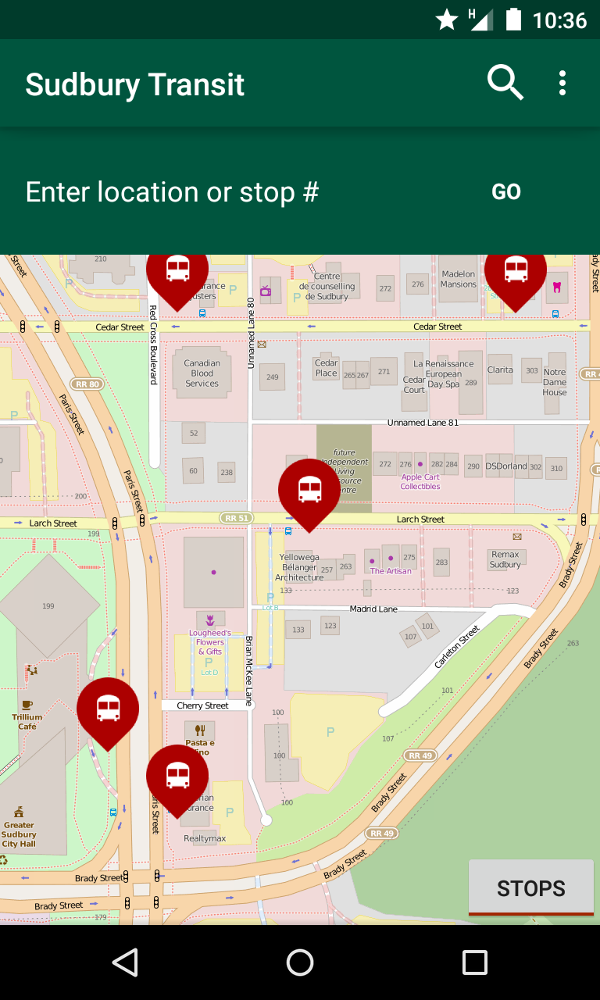
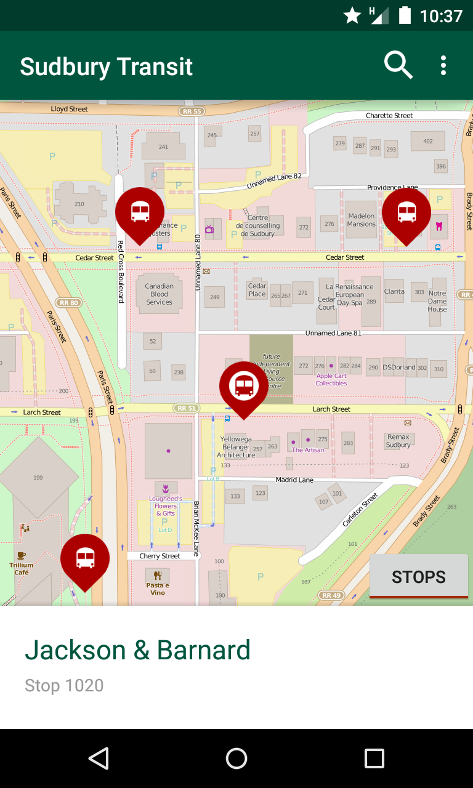
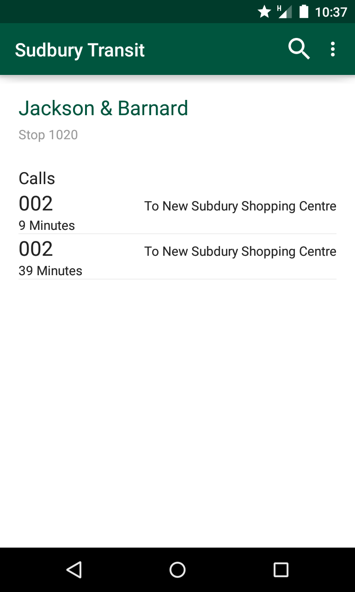

Sudbury-Transit
---------------

An unnofical, early development application that aims to provide a simple way to access information from the sudbury transit api on android, without any proprietary code.

Features
--------






- View realtime bus arival estimates for stops
- View stops on a map
- Search for stops by name, number, or address

Not quite ready:
- Trip planning (we need route times from the city). The current code for this feature is in the dev branch.

Building
--------

This project makes use of many great open source projects, including Osmdroid (open street map on android), pelias (for geocoding), slideuppanel, and retrofit (for accessing the json api).

To build, add a file in res/values called prod.xml:

```
<?xml version="1.0" encoding="utf-8"?>
<resources>
    <string name="mybus_api_key">[Your api key here]</string>
</resources>
```

You can get an api key from http://mybus.greatersudbury.ca/api/


Icons
------
Bus icon, used with modifications, from
https://thenounproject.com/term/bus-stop/5551/
By Venkatesh Aiyulu, IN
